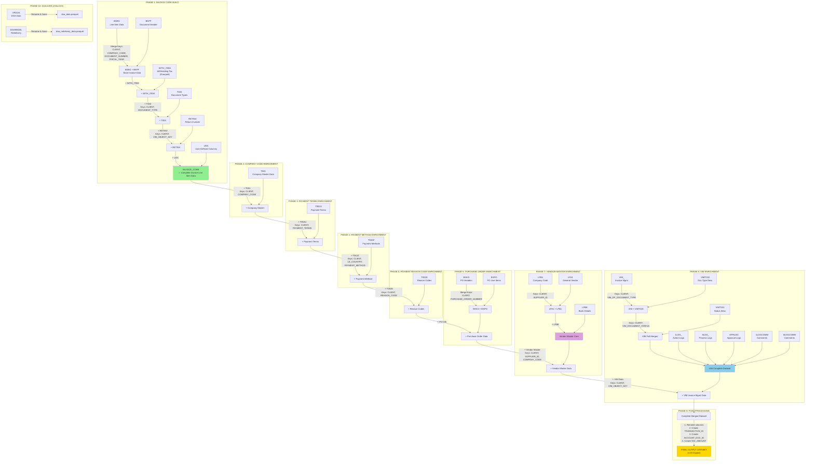

### ASCII Flowchart (Text Version)

<details>
<summary>Click to expand ASCII diagram</summary>

```
┌─────────────────────────────────────────────────────────────────────────────┐
│                         PHASE 1: INVOICE CORE BUILD                          │
│                         (build_invoice_core function)                        │
└─────────────────────────────────────────────────────────────────────────────┘

┌──────────┐      ┌──────────┐
│  BSEG    │      │  BKPF    │
│(Line Item│  +   │(Document │
│  Data)   │      │ Header)  │
└────┬─────┘      └────┬─────┘
     │                 │
     │  Merge Keys: CLIENT, COMPANY_CODE,
     │              DOCUMENT_NUMBER, FISCAL_YEAR
     │                 │
     └────────┬────────┘
              ↓
      ┌───────────────┐
      │ BSEG + BKPF   │ ← Base Invoice Data (Line Item Level)
      │               │
      └───────┬───────┘
              │
              │  + Merge WITH_ITEM (Withholding Tax)
              │    Keys: CLIENT, COMPANY_CODE, DOCUMENT_NUMBER, FISCAL_YEAR
              │    (Grouped - one record per document)
              ↓
      ┌───────────────┐
      │+ WITH_ITEM    │
      └───────┬───────┘
              │
              │  + Merge T003 (Document Type Descriptions)
              │    Keys: CLIENT, DOCUMENT_TYPE
              ↓
      ┌───────────────┐
      │ + T003        │
      └───────┬───────┘
              │
              │  + Merge RETINV (Return Invoice Data)
              │    Keys: CLIENT, VIM_OBJECT_KEY
              │    (VIM_OBJECT_KEY = COMPANY_CODE + DOCUMENT_NUMBER + FISCAL_YEAR)
              ↓
      ┌───────────────┐
      │ + RETINV      │
      └───────┬───────┘
              │
              │  + Merge UDC (User Defined Columns)
              │    Keys: CLIENT, VIM_OBJECT_KEY
              ↓
      ┌───────────────┐
      │ INVOICE_CORE  │ ✓ Complete Invoice Line Item Data
      └───────┬───────┘
              │
              ↓

┌─────────────────────────────────────────────────────────────────────────────┐
│                    PHASE 2: COMPANY CODE ENRICHMENT                          │
└─────────────────────────────────────────────────────────────────────────────┘

      ┌───────────────┐
      │ INVOICE_CORE  │
      └───────┬───────┘
              │
              │  + Merge T001 (Company Master Data)
              │    Keys: CLIENT, COMPANY_CODE
              │    Adds: LE_ADDRESS, LE_COUNTRY, etc.
              ↓
      ┌───────────────────┐
      │ + Company Master  │
      └──────────┬────────┘
                 ↓

┌─────────────────────────────────────────────────────────────────────────────┐
│                    PHASE 3: PAYMENT TERMS ENRICHMENT                         │
└─────────────────────────────────────────────────────────────────────────────┘

      ┌───────────────────┐
      │+ Company Master   │
      └──────────┬────────┘
                 │
                 │  + Merge T052U (Payment Terms)
                 │    Keys: CLIENT, PAYMENT_TERMS
                 │    Adds: Payment term descriptions
                 ↓
      ┌───────────────────┐
      │ + Payment Terms   │
      └──────────┬────────┘
                 ↓

┌─────────────────────────────────────────────────────────────────────────────┐
│                   PHASE 4: PAYMENT METHOD ENRICHMENT                         │
└─────────────────────────────────────────────────────────────────────────────┘

      ┌───────────────────┐
      │ + Payment Terms   │
      └──────────┬────────┘
                 │
                 │  + Merge T042Z (Payment Methods)
                 │    Keys: CLIENT, LE_COUNTRY, PAYMENT_METHOD
                 │    Adds: Payment method descriptions
                 ↓
      ┌───────────────────┐
      │+ Payment Method   │
      └──────────┬────────┘
                 ↓

┌─────────────────────────────────────────────────────────────────────────────┐
│                  PHASE 5: PAYMENT REASON CODE ENRICHMENT                     │
└─────────────────────────────────────────────────────────────────────────────┘

      ┌───────────────────┐
      │+ Payment Method   │
      └──────────┬────────┘
                 │
                 │  + Merge T053S (Payment Reason Codes)
                 │    Keys: CLIENT, REASON_CODE
                 │    Adds: Reason code descriptions
                 ↓
      ┌───────────────────┐
      │ + Reason Codes    │
      └──────────┬────────┘
                 ↓

┌─────────────────────────────────────────────────────────────────────────────┐
│                    PHASE 6: PURCHASE ORDER ENRICHMENT                        │
└─────────────────────────────────────────────────────────────────────────────┘

      ┌───────────────────┐
      │ + Reason Codes    │
      └──────────┬────────┘
                 │
    ┌────────────┴────────────┐
    │                         │
┌───▼─────┐           ┌───────▼────┐
│  EKKO   │           │    EKPO    │
│(PO      │  Merged → │(PO Line    │
│ Header) │           │  Items)    │
└─────────┘           └────────────┘
         Merge Keys: CLIENT, PURCHASE_ORDER_NUMBER
                     │
                     │  + Merge PO Info
                     │    Keys: CLIENT, PURCHASE_ORDER_NUMBER, PO_LINE_ITEM
                     ↓
      ┌───────────────────────┐
      │ + Purchase Order Data │
      └──────────┬────────────┘
                 ↓

┌─────────────────────────────────────────────────────────────────────────────┐
│                   PHASE 7: VENDOR MASTER ENRICHMENT                          │
└─────────────────────────────────────────────────────────────────────────────┘

Building Vendor Master Core:
┌──────────┐      ┌──────────┐      ┌──────────┐      ┌──────────┐
│  LFA1    │      │  LFB1    │      │  LFBK    │      │  LFM1    │
│(General  │  +   │(Company  │  +   │(Bank     │  +   │(Purch.   │
│ Vendor)  │      │  Code)   │      │ Details) │      │  Org)    │
└────┬─────┘      └────┬─────┘      └────┬─────┘      └────┬─────┘
     │                 │                   │                 │
     │  Step 1: LFA1 + LFB1                │                 │
     │  Keys: CLIENT, SUPPLIER_ID          │                 │
     └────────┬────────┘                   │                 │
              ↓                            │                 │
      ┌───────────────┐                    │                 │
      │ LFA1 + LFB1   │                    │                 │
      └───────┬───────┘                    │                 │
              │  Step 2: + LFBK            │                 │
              │  Keys: CLIENT, SUPPLIER_ID │                 │
              └──────────┬─────────────────┘                 │
                         ↓                                   │
              ┌────────────────────┐                         │
              │ Vendor Master Core │                         │
              └──────────┬─────────┘                         │
                         │  (LFM1 optional, not fully impl.) │
                         └───────────────────────────────────┘
                                   ↓
                    ┌──────────────────────────┐
                    │   VENDOR MASTER CORE     │
                    └─────────────┬────────────┘
                                  │
      ┌───────────────────────────┤
      │                           │
      │  + Merge Vendor Master    │
      │    Keys: CLIENT, SUPPLIER_ID, COMPANY_CODE
      ↓                           │
┌──────────────────────┐          │
│ + Vendor Master Data │          │
└──────────┬───────────┘          │
           ↓                      │

┌─────────────────────────────────────────────────────────────────────────────┐
│                    PHASE 8: VIM (INVOICE MGMT) ENRICHMENT                    │
└─────────────────────────────────────────────────────────────────────────────┘

Building VIM Core:
┌──────────┐      ┌──────────┐      ┌──────────┐
│  VIM_    │      │ VIMT100  │      │ VIMT101  │
│(Invoice  │  +   │(Doc Type │  +   │(Status   │
│  Mgmt)   │      │  Desc)   │      │  Desc)   │
└────┬─────┘      └────┬─────┘      └────┬─────┘
     │                 │                  │
     │  Merge Keys:    │                  │
     │  CLIENT, VIM_DP_DOCUMENT_TYPE     │
     └────────┬────────┘                  │
              ↓                           │
      ┌──────────────┐                    │
      │VIM+VIMT100   │                    │
      └──────┬───────┘                    │
             │  Merge Keys:               │
             │  CLIENT, VIM_DOCUMENT_STATUS
             └─────────┬──────────────────┘
                       ↓
             ┌──────────────────┐
             │  VIM Full Merged │
             └────────┬─────────┘
                      │
        ┌─────────────┼─────────────┐
        │             │             │
┌───────▼───────┐ ┌──▼────────┐ ┌──▼────────┐
│   1LOG_       │ │  8LOG_    │ │  APRLOG   │
│(Action Logs)  │ │(Process   │ │(Approval  │
│               │ │ Logs)     │ │ Logs)     │
└───────┬───────┘ └──┬────────┘ └──┬────────┘
        │            │             │
┌───────▼───────┐ ┌──▼────────┐   │
│  1LOGCOMM     │ │ 8LOGCOMM  │   │
│(Comments)     │ │(Comments) │   │
└───────┬───────┘ └──┬────────┘   │
        │            │             │
        └────────────┴─────────────┘
                     │
                     ↓
        ┌────────────────────────┐
        │  VIM Complete Dataset  │
        └───────────┬────────────┘
                    │
                    │  + Merge VIM Data
                    │    Keys: CLIENT, VIM_OBJECT_KEY
                    ↓
      ┌──────────────────────────┐
      │ + VIM Invoice Mgmt Data  │
      └──────────┬───────────────┘
                 ↓

┌─────────────────────────────────────────────────────────────────────────────┐
│                     PHASE 9: POST-PROCESSING                                 │
└─────────────────────────────────────────────────────────────────────────────┘

      ┌──────────────────────────┐
      │ Complete Merged Dataset  │
      └──────────┬───────────────┘
                 │
                 │  1. Rename DOCUMENT_NUMBER_Invoice → DOCUMENT_NUMBER
                 │  2. Create TRANSACTION_ID (row-level unique ID)
                 │  3. Create ACCOUNT_DOC_ID (document-level unique ID)
                 │     = CLIENT + COMPANY_CODE + FISCAL_YEAR + DOCUMENT_NUMBER
                 │  4. Create TAX_AMOUNT (sum of line items where LINE_ITEM_ID='T')
                 │     at ACCOUNT_DOC_ID level
                 ↓
      ┌──────────────────────────┐
      │  FINAL OUTPUT DATASET    │
      │  (CSV Export)            │
      └──────────────────────────┘

┌─────────────────────────────────────────────────────────────────────────────┐
│                  PHASE 10: DOA DATA PROCESSING (Z-BLOCK)                     │
└─────────────────────────────────────────────────────────────────────────────┘

If z_block=True:
┌──────────┐      ┌──────────┐
│  VRDOA   │      │ DOAREDEL │
│(DOA Data)│      │(Redelivery│
└────┬─────┘      └────┬─────┘
     │                 │
     │  Rename columns │
     │  Save as parquet│
     └─────────────────┘
```

</details>

---

## 📋 Table Summary

### **Input Tables (21 Core + 5 Z-Block)**

#### **Core Tables (Always Loaded)**
| Table | Description | Role | Merge Keys |
|-------|-------------|------|------------|
| **BSEG** | Line Item Data | Base table - line items of accounting documents | CLIENT, COMPANY_CODE, DOCUMENT_NUMBER, FISCAL_YEAR |
| **BKPF** | Document Header | Document-level header information | CLIENT, COMPANY_CODE, DOCUMENT_NUMBER, FISCAL_YEAR |
| **WTH** | Withholding Tax | Tax information at document level | CLIENT, COMPANY_CODE, DOCUMENT_NUMBER, FISCAL_YEAR |
| **T003** | Document Types | Document type descriptions | CLIENT, DOCUMENT_TYPE |
| **RETINV** | Return Invoices | Return invoice reference data | CLIENT, VIM_OBJECT_KEY |
| **UDC** | User Defined Columns | Custom fields/extensions | CLIENT, VIM_OBJECT_KEY |
| **T001** | Company Codes | Company master data, legal entity info | CLIENT, COMPANY_CODE |
| **T052U** | Payment Terms | Payment terms descriptions | CLIENT, PAYMENT_TERMS |
| **T042Z** | Payment Methods | Payment method master data | CLIENT, LE_COUNTRY, PAYMENT_METHOD |
| **T053S** | Reason Codes | Payment block reason codes | CLIENT, REASON_CODE |
| **EKKO** | PO Headers | Purchase order header data | CLIENT, PURCHASE_ORDER_NUMBER |
| **EKPO** | PO Line Items | Purchase order line item details | CLIENT, PURCHASE_ORDER_NUMBER, PO_LINE_ITEM |
| **LFA1** | Vendor Master (General) | General vendor information | CLIENT, SUPPLIER_ID |
| **LFB1** | Vendor Master (Company) | Vendor-company code data | CLIENT, SUPPLIER_ID, COMPANY_CODE |
| **LFBK** | Vendor Bank Details | Vendor banking information | CLIENT, SUPPLIER_ID |
| **LFM1** | Vendor Purchasing Org | Vendor purchasing org data (optional) | CLIENT, SUPPLIER_ID |
| **VIM_** | Invoice Management | VIM document management data | CLIENT, VIM_OBJECT_KEY |
| **VIMT100** | VIM Doc Types | VIM document type descriptions | CLIENT, VIM_DP_DOCUMENT_TYPE |
| **VIMT101** | VIM Status | VIM document status descriptions | CLIENT, VIM_DOCUMENT_STATUS |
| **1LOG_** | VIM Action Logs | Invoice management action logs | CLIENT, VIM_1LOG_DOCUMENT_ID |
| **8LOG_** | VIM Process Logs | Invoice processing logs | CLIENT, VIM_8LOG_DOCUMENT_LOG_ID |
| **APRLOG** | VIM Approval Logs | Approval workflow logs (filtered for Action='A') | CLIENT, DOCUMENT_ID |
| **1LOGCOMM** | Action Log Comments | Comments on action logs (grouped) | CLIENT, VIM_1LOG_DOCUMENT_ID |
| **8LOGCOMM** | Process Log Comments | Comments on process logs (grouped) | CLIENT, VIM_8LOG_DOCUMENT_LOG_ID |

#### **Z-Block Only Tables (z_block=True)**
| Table | Description | Output |
|-------|-------------|--------|
| **VRDOA** | DOA Data | Saved as parquet: doa_data.parquet |
| **DOAREDEL** | DOA Redelivery | Saved as parquet: doa_redelivery_data.parquet |

---

## 🔑 Key Merge Operations

### **1. Invoice Core Build (build_invoice_core)**
```
BSEG (line items) 
  ← LEFT JOIN → BKPF (headers)
  ← LEFT JOIN → WTH (withholding tax, grouped)
  ← LEFT JOIN → T003 (document types)
  ← LEFT JOIN → RETINV (return invoices)
  ← LEFT JOIN → UDC (user defined columns)
```

### **2. Company Master Lookup**
```
Invoice Core 
  ← LEFT JOIN → T001 (company master)
```

### **3. Payment Terms Lookup**
```
Invoice + Company 
  ← LEFT JOIN → T052U (payment terms)
```

### **4. Payment Method Lookup**
```
Invoice + Payment Terms 
  ← LEFT JOIN → T042Z (payment methods)
```

### **5. Payment Reason Code Lookup**
```
Invoice + Payment Methods 
  ← LEFT JOIN → T053S (reason codes)
```

### **6. Purchase Order Details**
```
EKKO (PO headers) 
  ← INNER JOIN → EKPO (PO items)
  
Invoice + Reason Codes 
  ← LEFT JOIN → (EKKO + EKPO) on PO_NUMBER, PO_LINE_ITEM
```

### **7. Vendor Master Core Build**
```
LFB1 (vendor company code) 
  ← LEFT JOIN → LFA1 (general vendor)
  ← LEFT JOIN → LFBK (bank details)

Invoice + PO Data 
  ← LEFT JOIN → Vendor Master Core
```

### **8. VIM Data Integration**
```
VIM_ (invoice mgmt) 
  ← LEFT JOIN → VIMT100 (doc types)
  ← LEFT JOIN → VIMT101 (status)

VIM Full 
  ← LEFT JOIN → 1LOG_ (action logs)
  ← LEFT JOIN → 8LOG_ (process logs)
  ← LEFT JOIN → APRLOG (approval logs)
  ← LEFT JOIN → 1LOGCOMM (action comments)
  ← LEFT JOIN → 8LOGCOMM (process comments)

Invoice + Vendor Master 
  ← LEFT JOIN → VIM Complete
```

---

## 📊 Final Output Structure

### **Key Columns in Final Dataset**

#### **Identifiers**
- `TRANSACTION_ID` - Row-level unique identifier (sequential)
- `ACCOUNT_DOC_ID` - Document-level unique identifier (factorized)
- `unique_id` - Composite key: CLIENT_COMPANY_CODE_FISCAL_YEAR_DOCUMENT_NUMBER

#### **Document Information**
- `CLIENT`, `COMPANY_CODE`, `FISCAL_YEAR`, `DOCUMENT_NUMBER`
- `LINE_ITEM_ID` - Line item type (e.g., 'T' for tax)
- `DOCUMENT_TYPE`, `DOCUMENT_TYPE_DESCRIPTION`

#### **Dates**
- `ENTERED_DATE`, `POSTED_DATE`, `INVOICE_DATE`, `DUE_DATE`
- `BASELINE_DATE`, `PAYMENT_DATE`, `INVOICE_RECEIPT_DATE`
- `QUARTER_LABEL` - Derived from POSTED_DATE

#### **Amounts**
- `LINEITEM_AMOUNT_IN_LOCAL_CURRENCY`
- `LINEITEM_AMOUNT_IN_DOCUMENT_CURRENCY`
- `TOTAL_AMOUNT`, `TOTAL_AMOUNT_LC`
- `TAX_AMOUNT` - Aggregated at ACCOUNT_DOC_ID level (sum where LINE_ITEM_ID='T')

#### **Vendor Information**
- `SUPPLIER_ID`, `VENDOR_NAME`, `VENDOR_ADDRESS`
- `VENDOR_COUNTRY`, `VENDOR_REGION`, `VENDOR_CITY`

#### **Company Information**
- `LE_ADDRESS`, `LE_COUNTRY` - Legal entity details

#### **Payment Information**
- `PAYMENT_TERMS`, `PAYMENT_METHOD`, `REASON_CODE`
- Related descriptions from lookup tables

#### **Purchase Order**
- `PURCHASE_ORDER_NUMBER`, `PO_LINE_ITEM`
- `PO_QUANTITY`, `NET_PRICE`, `GROSS_VALUE`

#### **VIM (Invoice Management)**
- `VIM_OBJECT_KEY` - Derived key for VIM data
- `VIM_DP_DOCUMENT_TYPE`, `VIM_DOC_TYPE_DESC`
- `VIM_DOCUMENT_STATUS`, `VIM_DOC_STATUS_DESC`
- Action logs, process logs, approval logs, and comments

#### **Other**
- `REGION_BSEG`, `REGION_BKPF` - Regional classifications
- `EXCHANGE_RATE`, `CURRENCY` fields
- Withholding tax fields from WTH table

---

## 📈 Data Quality Validations

### **Null Checks Performed**
The pipeline validates critical fields cannot be null:
- `ENTERED_DATE`
- `POSTED_DATE`
- `DUE_DATE`
- `INVOICE_DATE`
- `VENDOR_NAME`
- `SUPPLIER_ID`

### **Duplicate Handling**
Duplicates are detected and removed (keeping last/first) for:
- BKPF headers
- T001, T052U, T042Z, T053S lookup tables
- EKKO purchase order headers
- LFA1 vendor master
- VIM lookup tables (VIMT100, VIMT101)

### **Merge Coverage Reporting**
For each merge operation, the pipeline logs:
- Number of matched records
- Percentage of coverage
- Null counts in key columns

---

## 📝 Output Files

### **Main Output**
- **Format**: CSV
- **Naming**: `{AP|Z}_sap_data_pipeline_test_output_{timestamp}.csv`
- **Granularity**: Line item level (one row per invoice line item)

### **DOA Output (Z-Block Only)**
- `doa_data.parquet` - DOA data from VRDOA table
- `doa_redelivery_data.parquet` - Redelivery data from DOAREDEL table

---

## 🔄 Data Granularity

### **Input Granularity**
- **BSEG**: Line item level (multiple lines per document)
- **BKPF**: Document header level (one per document)
- **EKPO**: PO line item level
- **LFB1**: Vendor-Company Code level
- **VIM_**: Document level

### **Output Granularity**
- **Final Dataset**: Line item level
  - Each row = one line item from BSEG
  - Enriched with header data, vendor data, PO data, VIM data
  - Tax amount aggregated at document level (ACCOUNT_DOC_ID)

---

## 🎯 Business Purpose

This pipeline creates a **comprehensive, flat, denormalized invoice dataset** suitable for:
- **Accounts Payable (AP) Analysis**
- **Invoice Verification workflows**
- **Duplicate invoice detection**
- **Vendor master validation**
- **Payment analytics**
- **Compliance reporting**
- **Anomaly detection** (AI/ML models)

The rolled-up structure eliminates the need for multiple table joins during analysis, providing a single source of truth for invoice-related data.

---

## 📅 Metadata

- **Date Range**: Logged from `POSTED_DATE` min/max
- **Document Count**: Unique `ACCOUNT_DOC_ID` values logged
- **Execution Time**: Full pipeline execution logged with timestamps
